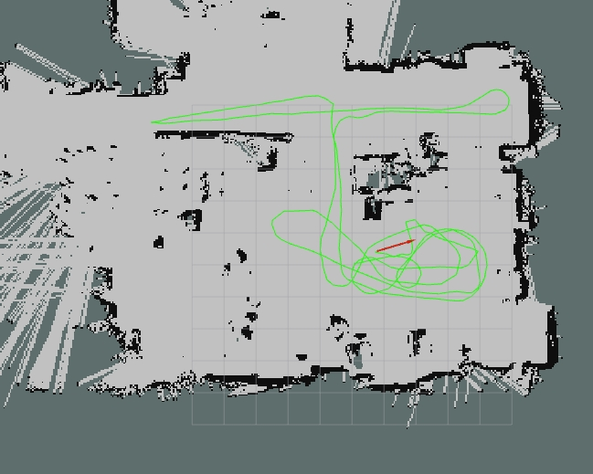

# ROS ~ Robotics course's second project
Politecnico di Milano - Accademic Year 2021-2022

>### Team
>*  [__Elia Maggioni__](https://github.com/Eliaxie) 
>*  [__Flavio Renzi__](https://github.com/FlavioRenzi)
>*  [__Jaskaran Singh__](https://github.com/zJaska) 

The project was implemented utilizing `ROS Noetic` on a `Linux Ubuntu 20.04` machine.<br>
Tested also with `ROS Melodic` on a `Linux Ubuntu 18.04` machine.


## Goals
- Write a launch files to create the map 
- Write a launch file to perform amcl based localization
- Write a service to save an image with the map and the trajectory of the robot
- A node is needed to publish the odometry as a tf
- A node is needed to merge the two lasers

##
> To see the complete requirements -> [Project presentation](Project2.pdf)

## Package content
- bags: directory containing the supplied bags.
- launch: directory containing the launch-file that sets the parameter for gmapping, amcl and the merging node
- src: contains the nodes, writtn in c++
- srv: contains the file to generate the service needed to save the map
- map: containing the final map generated by gmap
- rviz: directory containing the config file to see the maping or the localization.
- script: contains a python node using openCV to process the image, publish a processed version and a png map

## Nodes
- OdomeryBroadcaster: this node reads the provided odometry and broadcasts the tf transformation.
- PathBroadcaster: the node reads the poses provided by amcl and stores them in a vector inside the `nav_msgs::Path` message pubblished on topic `/path`
- CustomMapSaver: this node is a modified version of the original one<sup>[2](#reference)</sup> of the ros map server.
It has the callback from the service to save the map along with the path computed by amcl.
- occupancy_grid_processing.py: reads the topic `/map` pubblished from gmapping and pubblish the processed map on topic `/my_map`


## Launch files
- link.launch: set up the basic transformations for the robot and start the merging node<sup>[1](#reference)</sup>
- gmap.launch: set up the parameter and launch the gmapping node which will pubblish the map and the transformation between `map` and `odom`
- amcl.launch: set up and run amcl for the locaization pubblishing the transformation between `map` and `odom`


## TF Tree

| Our tf tree is composed of six transformation frames (map, odom, base_footprint, base_link, laser_front and laser_rear)<br><br>  <li> There are static transformations linking the `base_footprint` to `base_link` and `base_link` to `laser_front` and `laser_rear`.<br><br><li> The `odom` to `base_footprint` transformation is pubblished from the `OdometryBroadcaster` node from the data on the bag.<br><br><li> The transformation between `map` and `odom` is broadcasted by the localization part of the algorithms running||
|---|---|

## How To Run

In order to run the gmapping algorithm and acml some packages are needed

For `ROS Melodic` on a `Linux Ubuntu 18.04` machine
```console
$ sudo apt install ros-melodic-robot-localization ros-melodic-imu-tools ros-melodic-rviz-imu-plugin ros-melodic-stage* ros-melodic-mapviz* ros-melodic-gmapping ros-melodic-amcl ros-melodic-navigation ros-melodic-ira-laser-tools
```
For `ROS Noetic` on a `Linux Ubuntu 20.04` machine
```console
$ sudo apt install ros-noetic-robot-localization ros-noetic-imu-tools ros-noetic-rviz-imu-plugin ros-noetic-stage* ros-noetic-mapviz* ros-noetic-gmapping ros-noetic-amcl ros-noetic-navigation ros-noetic-ira-laser-tools
```

The provided commands will run all the nodes specified in the launch file and a precofigured rviz to look at the mapping.


```console
$ roslaunch RoboticsProject_2 gmap.launch
```

The map can be saved with this command

```console
$ rosrun map_server map_saver -f map
```
The postprocessed map can be saved with this command

```console
$ rosrun map_server map_saver -f map map:=/my_map
```

This command will run the localization with acml and open rviz preconfigured.

```console
$ roslaunch RoboticsProject_2 acml.launch
```

To save the map with the computed path use the following command.\
This will save the map in the package directory with the provided name
```console
$ rosservice call save_map CustomMap
```

## Results
|We generate the map using the first bag provided.||
|---|---|

We use the generated map to implement localization using amcl on the other 2 bags saving the path of the robot.
| bag 2 | bag 3 |
|---|---|
|||
## Reference
- [Node for join different laser scan](https://github.com/iralabdisco/ira_laser_tools)<sup>[1]</sup>
- [Original map saver](https://github.com/ros-planning/navigation/blob/noetic-devel/map_server/src/map_saver.cpp)<sup>[2]</sup>

